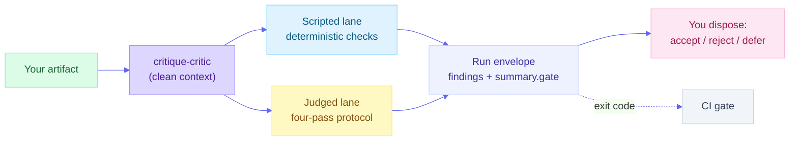
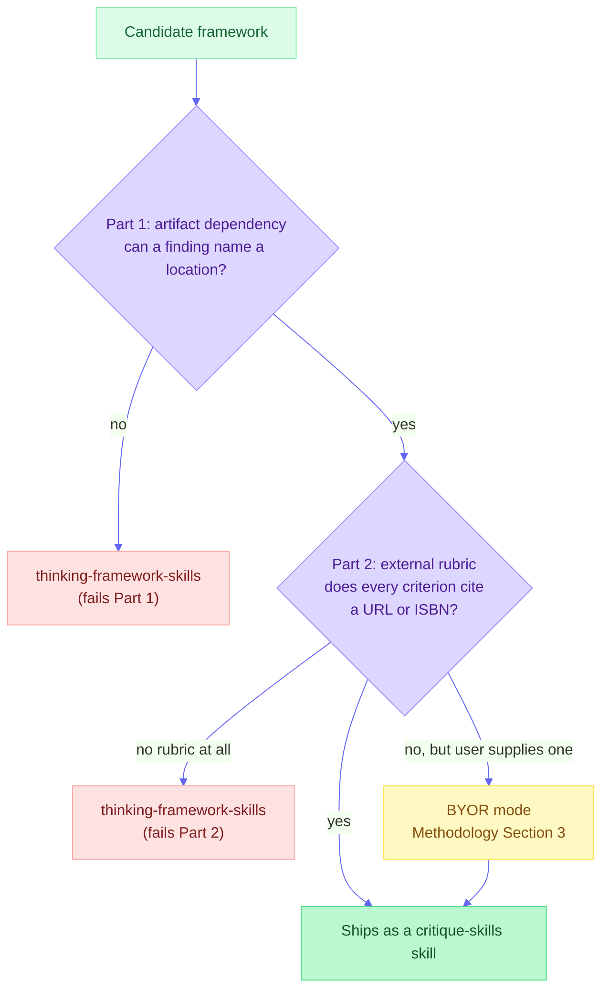

<a id="readme-top"></a>

# [Critique Skills](https://github.com/product-on-purpose/critique-skills)

**A measured library of rubric-cited critique skills that emit machine-parseable findings.**

Every skill operationalizes a published external standard, cites a permanent criterion ID on every finding, and publishes its own measured performance against a seeded-defect corpus. No taste, no vibes, no unfalsifiable commentary.

<p>
  
  <a href="LICENSE"></a>
  
  <a href="#-conformance-what-convergent-silver-tier-means"></a>
  <a href="#-the-six-skills"></a>
  <a href="docs/reference/criterion-ids.md"></a>
  <a href="#-the-receipts"></a>
  <a href="https://agentskills.io/specification"></a>
</p>

[**What it is**](#-what-this-is) &nbsp;·&nbsp; [**Install**](#-quick-start) &nbsp;·&nbsp; [**Receipts**](#-the-receipts) &nbsp;·&nbsp; [**Skills**](#-the-six-skills) &nbsp;·&nbsp; [**Examples**](#-examples-and-recipes) &nbsp;·&nbsp; [**Methodology**](docs/explanation/methodology.md)

---

> [!NOTE]
> **First release (v0.1.0).** The finding contract, the severity scale, and the criterion IDs are stable commitments. The measured numbers are honest but young: they come from one benchmark cycle on two pinned model tiers, and the consistency floor calibrated to **0.309**, well below the 0.7 that was proposed before any data existed. Read [`bench/results/README.md`](bench/results/README.md) (unflattering numbers first) before you rely on any figure here.

---

<details>
<summary><strong>Table of Contents</strong></summary>

- [What this is](#-what-this-is)
- [Quick start](#-quick-start)
- [The receipts](#-the-receipts)
- [What makes it different](#-what-makes-it-different)
- [The six skills](#-the-six-skills)
- [How a critique runs](#-how-a-critique-runs)
- [Examples and recipes](#-examples-and-recipes)
- [Where this stops, and thinking-framework-skills starts](#-where-this-stops-and-thinking-framework-skills-starts)
- [The family](#-the-family)
- [Documentation](#-documentation)
- [Conformance: what convergent (Silver) tier means](#-conformance-what-convergent-silver-tier-means)
- [Project status](#-project-status)
  - [At a glance](#at-a-glance) · [Repo structure](#repo-structure) · [Changelog](#changelog)
- [Contributing](#-contributing)
- [License](#-license)
- [About the maintainer](#-about-the-maintainer)

</details>

---

## 🔍 What this is

Ask a general-purpose model to critique your work and you get fluent, confident, forgettable commentary. It changes between runs. It cites nothing. It cannot tell you whether it found everything or merely something. It has no way to be wrong.

`critique-skills` attacks that one job. Every skill here operationalizes a published external standard (WCAG 2.2, Nielsen's usability heuristics, the Toulmin model, Diataxis, NN/g's error-message guidelines, the Federal Plain Language Guidelines, Williams' *Style*), emits findings as structured records rather than prose, and reports what it actually catches against a corpus with known ground truth.

The claim is not that these skills critique better than a good model does. It is that they critique **accountably**, which is a different and more durable property. As models improve, generic critique improves with them. It does not acquire citations, repeatability, or ground truth. Those are properties of the system built around the model.

| It is | It is not |
|---|---|
| **Rubric-cited** - every finding carries a permanent criterion ID tracing to a published standard | A "act as a harsh critic" prompt with better wording |
| **Machine-parseable** - findings are structured records with evidence, location, severity, and fix | Prose you re-read and summarize by hand |
| **Measured** - seeded-defect recall, precision, and run-to-run consistency, published with model IDs pinned | A quality claim you are asked to take on faith |
| **Two-lane and honest about it** - deterministic scripts where computation suffices, model judgment only where judgment is required | A single opaque pass that calls everything "AI-powered" |
| **Human-in-the-loop by contract** - skills report, a person disposes, nothing auto-edits | An agent that rewrites your document on its own authority |

<p align="right">(<a href="#readme-top">back to top</a>)</p>

---

## ⚡ Quick start

> [!NOTE]
> **Published, and pinned.** The `product-on-purpose` marketplace pins `critique-skills` to the `v0.1.0` release tag, so `/plugin install` gives you exactly that commit rather than whatever `main` happens to hold when you run it.

**Claude Code (recommended):**

```bash
/plugin marketplace add product-on-purpose/agent-plugins
/plugin install critique-skills@product-on-purpose
```

**Cross-agent** (Cursor, Copilot, Cline, and others via the open [skills CLI](https://github.com/vercel-labs/skills)):

```bash
npx skills add product-on-purpose/critique-skills
```

**Clone or download:**

```bash
git clone https://github.com/product-on-purpose/critique-skills.git
```

**Your first run.** There is no separate CLI. Describe what you want in plain language and the matching skill triggers on its own description:

```
review this page for accessibility problems
give me a clarity pass on this memo before it goes out
```

You get back a set of findings, each with a criterion ID, a severity on a shared 0-4 scale, a location you can navigate to, quoted or measured evidence, and an actionable fix. You decide what to accept, reject, or defer; the library records that disposition and never edits your artifact itself.

> 📖 Start to finish in one path, no branches: [`QUICKSTART.md`](QUICKSTART.md). Worked examples for every skill: [`examples/`](examples/).

<p align="right">(<a href="#readme-top">back to top</a>)</p>

---

## 📊 The receipts

The tables below are generated, unedited, from the run envelopes in [`bench/results/`](bench/results/). They come before the claim because that is the order that earns trust.

The first table is the fair one: **location-level, criterion ignored**, the only comparison here the frozen baseline could actually have won. `beats baseline` means the skill located more seeded defects than a generic "critique this" prompt with no rubric at all, at equal-or-better precision, on the same artifacts and the same pinned model. `no pass on this tier` means it did not, even where it won one of the two metrics, and names the sibling tier that qualifies the skill if one does.

A criterion-level table further down measures something different: whether each skill operationalizes **its own** rubric. The baseline has no rubric to cite, so its criterion-level score is 0.000 by construction rather than by measurement, and no baseline verdict is shown at that level.

Regenerate with `python -m bench.report table --results bench/results/results.json --target README.md`; add `--check` to detect drift (CI does).

<!-- bench-results:start -->
<!-- Generated by `python -m bench.report table`. Do not edit by hand: edit `bench/results/p3-2026-07-31-plus-cal1-2026-08-01/results.json` and regenerate. -->

Run set `p3-2026-07-31-plus-cal1-2026-08-01`, generated 2026-08-01T06:56:00Z.

**Baseline comparison (location-level, criterion ignored).** The fair cross-condition comparison, first because it is the one the baseline could actually have failed; not pinned at 0.000. A skill passes a tier by beating baseline recall at equal-or-better precision, or by tying recall and winning precision; a tier that wins one metric and loses the other reads "no pass on this tier", annotated with the sibling tier that qualifies the skill if one does. See bench/results/README.md, "Baseline comparison", and bench/results/verdicts.md, "The gate".

| Skill | Version | Domain | Model | Skill recall (location) | Baseline recall (location) | Skill precision (location) | Baseline precision (location) | Verdict |
|---|---|---|---|---|---|---|---|---|
| critique-accessibility | 0.1.0 | accessibility | claude-haiku-4-5-20251001 | 0.176 | 0.376 | 0.158 | 0.258 | below baseline |
| critique-accessibility | 0.1.1 | accessibility | claude-haiku-4-5-20251001 | 0.988 | 0.376 | 0.875 | 0.258 | beats baseline |
| critique-accessibility | 0.1.0 | accessibility | claude-sonnet-5 | 0.306 | 0.776 | 0.202 | 0.293 | below baseline |
| critique-accessibility | 0.1.1 | accessibility | claude-sonnet-5 | 0.965 | 0.776 | 0.672 | 0.293 | beats baseline |
| critique-argument | 0.1.0 | argument | claude-haiku-4-5-20251001 | 0.825 | 0.525 | 0.579 | 0.189 | beats baseline |
| critique-argument | 0.1.0 | argument | claude-sonnet-5 | 0.775 | 0.725 | 0.470 | 0.228 | beats baseline |
| critique-clarity | 0.1.0 | clarity | claude-haiku-4-5-20251001 | 0.780 | 0.540 | 0.419 | 0.329 | beats baseline |
| critique-clarity | 0.1.0 | clarity | claude-sonnet-5 | 0.890 | 0.880 | 0.434 | 0.335 | beats baseline |
| critique-docs | 0.1.0 | docs | claude-haiku-4-5-20251001 | 0.933 | 0.933 | 0.875 | 0.275 | ties baseline |
| critique-docs | 0.1.0 | docs | claude-sonnet-5 | 1.000 | 1.000 | 1.000 | 0.238 | ties baseline |
| critique-microcopy | 0.1.0 | microcopy | claude-haiku-4-5-20251001 | 0.920 | 0.813 | 0.831 | 0.581 | beats baseline |
| critique-microcopy | 0.1.0 | microcopy | claude-sonnet-5 | 0.960 | 0.840 | 0.911 | 0.481 | beats baseline |
| critique-usability | 0.1.0 | usability | claude-haiku-4-5-20251001 | 0.800 | 0.000 | 0.231 | 0.000 | beats baseline |
| critique-usability | 0.1.0 | usability | claude-sonnet-5 | 0.857 | 0.829 | 0.169 | 0.181 | no pass on this tier (qualifies via haiku) |

**Full per-run figures.** Every skill, baseline, model, and domain in this run set; the location-level table above and the rubric-operationalization table below are both derived from these rows.

| Skill | Version | Model | Domain | Artifact type | Artifact-runs (k=5) | Recall | Precision | Clean FP rate | Consistency | Consistency (exact) | Unresolvable |
|---|---|---|---|---|---|---|---|---|---|---|---|
| baseline-generic | 1.0.0 | claude-haiku-4-5-20251001 | accessibility | html | 20 | 0.000 | 0.000 | 5.000 | 0.175 | 0.172 | 66 |
| baseline-generic | 1.0.0 | claude-sonnet-5 | accessibility | html | 20 | 0.000 | 0.000 | 8.200 | 0.653 | 0.326 | 8 |
| critique-accessibility | 0.1.0 | claude-haiku-4-5-20251001 | accessibility | html | 20 | 0.176 | 0.158 | 1.000 | 0.362 | 0.351 | 71 |
| critique-accessibility | 0.1.0 | claude-sonnet-5 | accessibility | html | 20 | 0.235 | 0.155 | 1.800 | 0.605 | 0.438 | 65 |
| critique-accessibility | 0.1.1 | claude-haiku-4-5-20251001 | accessibility | html | 20 | 0.976 | 0.865 | 0.600 | 0.625 | 0.625 | 3 |
| critique-accessibility | 0.1.1 | claude-sonnet-5 | accessibility | html | 20 | 0.965 | 0.672 | 1.200 | 0.808 | 0.686 | 0 |
| baseline-generic | 1.0.0 | claude-haiku-4-5-20251001 | argument | markdown-prose | 15 | 0.000 | 0.000 | 7.000 | 0.600 | 0.363 | 2 |
| baseline-generic | 1.0.0 | claude-sonnet-5 | argument | markdown-prose | 15 | 0.000 | 0.000 | 7.600 | 0.718 | 0.538 | 1 |
| critique-argument | 0.1.0 | claude-haiku-4-5-20251001 | argument | markdown-prose | 15 | 0.775 | 0.544 | 1.200 | 0.371 | 0.286 | 0 |
| critique-argument | 0.1.0 | claude-sonnet-5 | argument | markdown-prose | 15 | 0.775 | 0.470 | 2.600 | 0.737 | 0.463 | 0 |
| baseline-generic | 1.0.0 | claude-haiku-4-5-20251001 | clarity | markdown-prose | 20 | 0.000 | 0.000 | 8.800 | 0.463 | 0.289 | 6 |
| baseline-generic | 1.0.0 | claude-sonnet-5 | clarity | markdown-prose | 20 | 0.000 | 0.000 | 10.000 | 0.672 | 0.468 | 0 |
| critique-clarity | 0.1.0 | claude-haiku-4-5-20251001 | clarity | markdown-prose | 20 | 0.710 | 0.382 | 8.600 | 0.309 | 0.263 | 18 |
| critique-clarity | 0.1.0 | claude-sonnet-5 | clarity | markdown-prose | 20 | 0.770 | 0.376 | 9.400 | 0.466 | 0.415 | 1 |
| baseline-generic | 1.0.0 | claude-haiku-4-5-20251001 | docs | markdown-tree | 20 | 0.000 | 0.000 | 5.000 | 0.479 | 0.389 | 20 |
| baseline-generic | 1.0.0 | claude-sonnet-5 | docs | markdown-tree | 20 | 0.000 | 0.000 | 6.200 | 0.537 | 0.535 | 14 |
| critique-docs | 0.1.0 | claude-haiku-4-5-20251001 | docs | markdown-tree | 20 | 0.933 | 0.875 | 0.000 | 0.842 | 0.675 | 3 |
| critique-docs | 0.1.0 | claude-sonnet-5 | docs | markdown-tree | 20 | 1.000 | 1.000 | 0.000 | 1.000 | 0.933 | 0 |
| baseline-generic | 1.0.0 | claude-haiku-4-5-20251001 | microcopy | markdown-prose | 20 | 0.000 | 0.000 | 5.200 | 0.521 | 0.311 | 18 |
| baseline-generic | 1.0.0 | claude-sonnet-5 | microcopy | markdown-prose | 20 | 0.000 | 0.000 | 6.000 | 0.610 | 0.659 | 14 |
| critique-microcopy | 0.1.0 | claude-haiku-4-5-20251001 | microcopy | markdown-prose | 20 | 0.840 | 0.759 | 0.000 | 0.768 | 0.768 | 0 |
| critique-microcopy | 0.1.0 | claude-sonnet-5 | microcopy | markdown-prose | 20 | 0.920 | 0.873 | 0.200 | 0.853 | 0.853 | 0 |
| baseline-generic | 1.0.0 | claude-haiku-4-5-20251001 | usability | html | 20 | 0.000 | 0.000 | 7.000 | 0.032 | 0.024 | 107 |
| baseline-generic | 1.0.0 | claude-sonnet-5 | usability | html | 20 | 0.000 | 0.000 | 6.800 | 0.377 | 0.246 | 30 |
| critique-usability | 0.1.0 | claude-haiku-4-5-20251001 | usability | html | 20 | 0.686 | 0.198 | 4.400 | 0.378 | 0.373 | 4 |
| critique-usability | 0.1.0 | claude-sonnet-5 | usability | html | 20 | 0.857 | 0.169 | 7.600 | 0.642 | 0.653 | 0 |

**Rubric operationalization (criterion-level).** Each skill's own recall and precision against its own cited criteria; not a baseline comparison. `baseline-generic` has no rubric to cite, so none of its claims can ever match a planted defect's criterion string and its criterion-level recall and precision are structurally 0.000 in every row, not measured; it is omitted from this table rather than shown as a comparison it cannot lose. See bench/results/README.md, "Baseline comparison".

| Skill | Version | Domain | Model | Recall | Precision |
|---|---|---|---|---|---|
| critique-accessibility | 0.1.0 | accessibility | claude-haiku-4-5-20251001 | 0.176 | 0.158 |
| critique-accessibility | 0.1.1 | accessibility | claude-haiku-4-5-20251001 | 0.976 | 0.865 |
| critique-accessibility | 0.1.0 | accessibility | claude-sonnet-5 | 0.235 | 0.155 |
| critique-accessibility | 0.1.1 | accessibility | claude-sonnet-5 | 0.965 | 0.672 |
| critique-argument | 0.1.0 | argument | claude-haiku-4-5-20251001 | 0.775 | 0.544 |
| critique-argument | 0.1.0 | argument | claude-sonnet-5 | 0.775 | 0.470 |
| critique-clarity | 0.1.0 | clarity | claude-haiku-4-5-20251001 | 0.710 | 0.382 |
| critique-clarity | 0.1.0 | clarity | claude-sonnet-5 | 0.770 | 0.376 |
| critique-docs | 0.1.0 | docs | claude-haiku-4-5-20251001 | 0.933 | 0.875 |
| critique-docs | 0.1.0 | docs | claude-sonnet-5 | 1.000 | 1.000 |
| critique-microcopy | 0.1.0 | microcopy | claude-haiku-4-5-20251001 | 0.840 | 0.759 |
| critique-microcopy | 0.1.0 | microcopy | claude-sonnet-5 | 0.920 | 0.873 |
| critique-usability | 0.1.0 | usability | claude-haiku-4-5-20251001 | 0.686 | 0.198 |
| critique-usability | 0.1.0 | usability | claude-sonnet-5 | 0.857 | 0.169 |
<!-- bench-results:end -->

Every number above traces to a committed run envelope under `bench/results/runs*/`: the scored grid and steering probes under `bench/results/runs/`, and the `critique-accessibility` 0.1.1 calibration numbers under `bench/results/runs-cal1/`. Nothing here is estimated, recalled, or asserted without a run that produced it.

<p align="right">(<a href="#readme-top">back to top</a>)</p>

---

## 🔬 What makes it different

Three mechanisms, and one story that shows why they matter.

**Every criterion has a permanent ID.** `WCAG-1.4.3`, `NNG-H4`, `TOULMIN-WARRANT`, `PLAIN-ACTIVE`. IDs are what convert impressionistic critique into countable events: findings become diffable across runs, comparable across models, and countable against ground truth. Nothing else in this library works without them ([`docs/reference/criterion-ids.md`](docs/reference/criterion-ids.md)).

**Compute what is computable; spend model judgment only where judgment is required.** Of the 96 criteria shipped here, **42 run as deterministic scripts** (contrast ratios, readability grades, passive-voice density, heading structure, link text) and **54 require judgment** (audience fit, whether a grouping is genuinely MECE, whether a warrant actually holds). Each skill declares its own split in frontmatter, so the determinism claim is auditable per skill rather than asserted globally. Scripted findings are bit-for-bit reproducible. Judged findings are not, and the library never claims otherwise: it claims they are **measured**.

**The library publishes its own performance.** Every skill runs against a seeded-defect corpus with known ground truth, five times per artifact per model, on two pinned model tiers, against that same rubric-free generic prompt. The lowest **gating** number is stated plainly rather than buried: `critique-clarity` on Haiku holds a run-to-run consistency of **0.309**, which is the stretch-gate floor precisely because it is the lowest any core skill measured. That is the floor, not the smallest figure published: precision falls to **0.155** and judged-lane consistency to **0.150** elsewhere in the run set. All of it is named in [`bench/results/README.md`](bench/results/README.md).

### The most instructive number is a failure

`critique-accessibility` 0.1.0 shipped, and then **lost to the unrubricked baseline** on location-level recall on both tiers: 0.176 against 0.376 on Haiku, 0.306 against 0.776 on Sonnet.

The root cause was not detection. The scripted lane was finding the defects. One helper was printing a line number where the location grammar required a navigable anchor, so half to three quarters of the skill's claims could not be resolved to anything, while the generic prompt "won" by habitually quoting element IDs it saw in the markup. Version 0.1.1 fixed exactly that and nothing else: location-level recall reads **0.988** on Haiku and **0.965** on Sonnet, beating baseline on both tiers on both metrics, and holding under a stricter exact-node scoring cut. Criterion-level recall, the skill's own rubric-operationalization cut, reads 0.976 on Haiku and 0.965 on Sonnet; see the receipts tables above.

Both versions stay published side by side in the table above. The failure was not deleted when the fix arrived, because the failure is the evidence: measurement caught what review would have shipped.

<p align="right">(<a href="#readme-top">back to top</a>)</p>

---

## 🗂️ The six skills

Each skill triggers on its own description, so you invoke it by describing what you want rather than by naming it. The table is generated from [`library.json`](library.json) and each skill's `SKILL.md` frontmatter: a skill appears here only once its status is `active`, so one that is built but held back by its own gate cannot silently look shipped.

Regenerate with `node scripts/gen-readme-catalog.mjs`; add `--check` for drift.

<!-- skill-catalog:start -->
<!-- Generated by `node scripts/gen-readme-catalog.mjs`. Do not edit by hand: edit `library.json` and the relevant skill's `SKILL.md` frontmatter, then regenerate. -->

| Skill | Reviews | Rubric | Version |
|---|---|---|---|
| [`critique-accessibility`](skills/critique-accessibility/SKILL.md) | Reviews HTML pages and fragments (markdown where mappable) against WCAG 2.2 AA: contrast, alt text, heading structure, link text, and keyboard and screen-reader access. | WCAG | 0.1.1 |
| [`critique-argument`](skills/critique-argument/SKILL.md) | Reviews argumentative prose - essays, proposals, position papers, recommendation memos, strategy docs, and op-eds - against the Toulmin model of argument: whether the claim, grounds, warrant, backing, qualifier, and rebuttal are present, explicit, and actually hold together. | TOULMIN | 0.1.0 |
| [`critique-clarity`](skills/critique-clarity/SKILL.md) | Reviews markdown or plain-text prose for clarity against the Federal Plain Language Guidelines and Williams' Style: readability, passive voice, sentence length, and nominalization density. | PLAIN, WILLIAMS | 0.1.0 |
| [`critique-docs`](skills/critique-docs/SKILL.md) | Reviews technical documentation pages and page trees written in markdown against the Diataxis framework: tutorial, how-to, reference, and explanation mode fit, plus heading structure, orphaned pages, cross-mode linking, and navigation-list length. | DIATAXIS | 0.1.0 |
| [`critique-microcopy`](skills/critique-microcopy/SKILL.md) | Reviews error messages, empty states, and other short microcopy strings, including screens annotated with placement, container, timing, and behavior context, against NN/g's error-message guidelines: plain language, specificity, constructive next steps, neutral tone, and recovery grace. | NNG-EM | 0.1.0 |
| [`critique-usability`](skills/critique-usability/SKILL.md) | Reviews HTML or markdown UI specs, wireframe write-ups, and page mockups against Nielsen's 10 usability heuristics: system status, user control and exits, consistency, error prevention and recovery, recognition over recall, and minimalist design. | NNG-HEURISTICS, NNG-SEVERITY | 0.1.0 |
<!-- skill-catalog:end -->

`critique-usability`'s claim is narrower than it may look: static specs and mockups (HTML or markdown UI specs, wireframe write-ups, page mockups), **not** live running applications.

<p align="right">(<a href="#readme-top">back to top</a>)</p>

---

## ⚙️ How a critique runs



In text: your artifact goes to critique-critic, which runs the critique in a clean context when a subagent tool is available (direct critique runs otherwise, without a separate critic step); from there, two lanes run unconditionally, a scripted lane of deterministic checks and a judged lane using the four-pass protocol. Both lanes write into one run envelope of findings plus a gate summary; a human disposes each finding, and the envelope's exit code also feeds a CI gate.

**Clean context.** Where a subagent tool is available, every skill delegates to [`critique-critic`](agents/critique-critic.md) so critique runs in a context that never saw the artifact being authored. A critic that inherits the author's framing inherits the author's blind spots, so the subagent also strips authorial steering out of its instructions and records that it did.

**The four-pass protocol.** Inventory the artifact without judging, sweep the rubric in fixed ID order, assign severities as a separate pass, then rank and bound. Fixed ordering suppresses the drift where a model fixates on the first vivid flaw and free-associates outward; separating severity from discovery stops severity inflation.

**Bounded output.** All severity 3 and 4 findings plus at most five below that, with the suppressed count reported so nothing disappears silently. Verbosity is variance, and unbounded runs cannot be compared.

**A gate you can act on.** Every run is wrapped in an envelope pinning skill version, contract version, and model ID, and carrying a `summary.gate` verdict. `--gate` mode turns any skill into a document linter: exit 0 clean, exit 1 on any severity 4, exit 2 above a configurable severity-3 threshold. See [`docs/how-to/gate-in-ci.md`](docs/how-to/gate-in-ci.md).

**Nothing auto-applies.** Skills report; a human disposes ([`docs/how-to/dispositions.md`](docs/how-to/dispositions.md)). The disposition log is both the safety property and the telemetry: acceptance rate per criterion is what tells the library which criteria are worth keeping.

<p align="right">(<a href="#readme-top">back to top</a>)</p>

---

## 📚 Examples and recipes

`examples/` holds nine self-contained pages: one worked walkthrough per skill above (an artifact,
its critique, and a human's disposition on each finding), plus three recipes showing how the pieces
fit together, gating CI, a multi-round revision loop, and clean-context subagent delegation. Every
page states plainly which parts are bit-for-bit reproducible and which are curated illustration from
this library's own validated golden fixtures. Start at `examples/README.md`, organized by task
rather than by file.

<p align="right">(<a href="#readme-top">back to top</a>)</p>

---

## 🧭 Where this stops, and thinking-framework-skills starts

**One test decides it: does the framework evaluate a concrete, already-existing artifact against a published external standard? Yes, it ships here. No, it belongs in [`thinking-framework-skills`](https://github.com/product-on-purpose/thinking-framework-skills).**

That is the Two-Part Gate, and it is the library's constitution ([`docs/explanation/methodology.md`](docs/explanation/methodology.md), Section 2). Run any candidate through the same two questions:



In text: a candidate that cannot name a location fails Part 1 and belongs in `thinking-framework-skills`. One that can but has no published, citable standard fails Part 2, unless a user supplies their own rubric file (BYOR), in which case it still ships here. Only a candidate that clears both parts ships as a skill.

The rejections matter more than the acceptances, because a gate that admits everything is not a gate. Applied to real candidates:

| Candidate | Where it belongs | Why |
|---|---|---|
| SWOT analysis | `thinking-framework-skills` | Evaluates a situation, not an artifact |
| Pre-mortem | `thinking-framework-skills` | Prospective: the thing assessed does not exist yet |
| Six Thinking Hats | `thinking-framework-skills` | A process protocol, not a standard with criteria |
| First-principles reasoning | `thinking-framework-skills` | A lens applied to problems, not a rubric applied to objects |
| "Is this strategy sound?" | `thinking-framework-skills` | No published rubric for strategic soundness survives citation |
| Heuristic evaluation of a UI | **here** (`critique-usability`) | A real artifact, scored against Nielsen's published heuristics |
| WCAG audit of a page | **here** (`critique-accessibility`) | A real artifact, scored against an open W3C standard |

"Red-team this strategy" graduates into this library only if it is scored against a published rubric. Asked plain, it stays thinking.

This library is also **not code review** (well served elsewhere, out of scope by choice) and **not auto-fix** (skills report, they never edit).

<p align="right">(<a href="#readme-top">back to top</a>)</p>

---

## 👪 The family

`critique-skills` is the third library in the Product on Purpose family, listed on the same marketplace and built to the same [agent-skills-toolkit](https://github.com/product-on-purpose/agent-skills-toolkit) Standard:

- [`thinking-framework-skills`](https://github.com/product-on-purpose/thinking-framework-skills) - the sibling on the other side of the gate: evidence-graded thinking methods applied *before* an artifact exists.
- [`pm-skills`](https://github.com/product-on-purpose/pm-skills) - product management skills and sub-agents across the product lifecycle.
- [`writing-style-catalog`](https://github.com/product-on-purpose/writing-style-catalog) - composable writing instructions along four orthogonal axes.
- [`agent-skills-toolkit`](https://github.com/product-on-purpose/agent-skills-toolkit) - the Standard and validators every family plugin, including this one, conforms to.

None of them depend on each other technically. They compose along one value chain: **think** with one, **make** with another, **judge** the result with this one.

<p align="right">(<a href="#readme-top">back to top</a>)</p>

---

## 📖 Documentation

| Where | What |
|---|---|
| [`ROADMAP.md`](ROADMAP.md) | Sequence-gated plan from here to v1.0: what shipped, what is next, and what is deliberately not being done |
| [`QUICKSTART.md`](QUICKSTART.md) | Tutorial: install, run one critique, read the envelope, record a disposition |
| [`examples/`](examples/) | Worked walkthroughs for all six skills, plus cross-cutting recipes |
| [`docs/explanation/methodology.md`](docs/explanation/methodology.md) | The constitution: the Two-Part Gate, the contract, severity, determinism, evaluation |
| [`docs/reference/critique-contract.md`](docs/reference/critique-contract.md) | Field-by-field contract for findings, envelopes, and gate exit codes |
| [`docs/reference/severity-scale.md`](docs/reference/severity-scale.md) | The shared 0-4 scale with per-domain anchors |
| [`docs/reference/criterion-ids.md`](docs/reference/criterion-ids.md) | ID grammar, permanence rules, and the namespace map |
| [`docs/how-to/gate-in-ci.md`](docs/how-to/gate-in-ci.md) | Wiring `--gate` into a pipeline |
| [`docs/how-to/dispositions.md`](docs/how-to/dispositions.md) | Recording accept, reject, and defer, and why the log exists |
| [`bench/README.md`](bench/README.md) | Corpus design, metric definitions, reproduction commands |
| [`bench/results/README.md`](bench/results/README.md) | Results narrative, unflattering numbers first |
| [`AGENTS.md`](AGENTS.md) | Agent-facing entry point and the full command reference |
| [`CONTRIBUTING.md`](CONTRIBUTING.md) | The Two-Part Gate as the bar for a new skill, the review order, and the paraphrase policy |
| [`SECURITY.md`](SECURITY.md) | What ships, what executes at checkout, and how to report a vulnerability |

<p align="right">(<a href="#readme-top">back to top</a>)</p>

---

## 🥈 Conformance: what convergent (Silver) tier means

This plugin is built to the family [Advanced Skill Library Standard](https://github.com/product-on-purpose/agent-skills-toolkit/blob/main/STANDARD.md), which certifies three tiers:

| Tier | Name | What it certifies |
|---|---|---|
| 🥇 | **Advanced (Gold)** | The plugin proves itself: self-hosting CI running the Standard's own validators, generated index and manifests, curated release notes, deprecation policy |
| 🥈 | **Convergent (Silver)** | The plugin declares its agent targets and emits each higher-order component correctly, with a manifest matching what is on disk |
| 🥉 | **Universal (Bronze)** | The skills are portable: valid frontmatter, an `AGENTS.md`, a manifest, references one level deep |

`critique-skills` validates at **convergent (Silver) with 0 errors and 0 warnings** against the pinned Standard. It reached Silver at its first release rather than Bronze because the `critique-critic` subagent is a Convergent-tier component, and the library's `critique-` component prefix was chosen from the start so no rename was needed to get there ([ADR 0024](docs/internal/decisions/)).

Gold is a roadmap item, gated on chain and hook eval coverage that only becomes meaningful once the revision loop ships as a chain. Reproduce the grade locally with the same command CI runs:

```bash
node scripts/check.mjs
```

<p align="right">(<a href="#readme-top">back to top</a>)</p>

---

## 📈 Project status

`v0.1.0` - **first release.** The contract, the severity scale, and the criterion IDs are stable commitments; the measured numbers are one honest cycle, not a settled science. Curated highlights live in [`RELEASE-NOTES.md`](RELEASE-NOTES.md); the full technical history is in [`CHANGELOG.md`](CHANGELOG.md); what is next, sequence-gated with no dates, is in [`ROADMAP.md`](ROADMAP.md).

### At a glance

|  |  |
|---|---|
| **Current version** | v0.1.0 |
| **Skills** | 6, across design, communication, and documentation |
| **Criteria** | 96 (42 scripted, 54 judged), each with a permanent ID |
| **Subagents** | 1 (`critique-critic`, clean-context) |
| **Conformance** | [convergent (Silver)](#-conformance-what-convergent-silver-tier-means), 0 errors / 0 warnings |
| **Measurement** | 502 committed run envelopes, k=5, two pinned model tiers, 23-artifact seeded corpus |
| **Tests** | 784 |
| **Spec** | [agentskills.io](https://agentskills.io/specification) |
| **License** | [Apache-2.0](LICENSE) (code) / CC-BY-4.0 (corpus) |
| **Install** | `/plugin install critique-skills@product-on-purpose`, pinned to `v0.1.0` - see [Quick start](#-quick-start) |

### Repo structure

```
critique-skills/
├── skills/                  # The six skills (the source of truth)
│   └── critique-<domain>/   #   SKILL.md, references/, scripts/checks.py, evals/, examples/
│   └── _shared/             #   Shared gate and envelope library (one implementation, six consumers)
├── agents/                  # critique-critic, the clean-context critic subagent
├── contract/                # The Critique Contract: JSON Schema, validator, gate exit codes
├── bench/                   # The benchmark
│   ├── generator/           #   Deterministic seeded-defect generator + per-domain modules
│   ├── corpus/              #   Generated artifacts + ground-truth manifests (CC-BY-4.0)
│   ├── metrics/             #   Recall, precision, consistency
│   ├── baseline/            #   The frozen generic prompt and its postprocess rule
│   └── results/             #   Run envelopes, results.json, verdicts, narrative
├── examples/                # Worked walkthroughs per skill + cross-cutting recipes
├── docs/                    # Diataxis: tutorials, how-to, reference, explanation
│   └── internal/            #   ADRs, release plans, execution reports
├── scripts/                 # check.mjs (the gate), generators, skill-selftest
├── .github/workflows/       # CI, on-demand benchmark, release
├── library.json             # Authored manifest (the canonical component index)
├── INDEX.md                 # Generated repo map (drift-checked)
├── CHANGELOG.md             # Technical version history
├── RELEASE-NOTES.md         # Curated, user-facing highlights
└── AGENTS.md                # Universal agent-discovery file
```

### Changelog

Full detail in [`CHANGELOG.md`](CHANGELOG.md); curated highlights in [`RELEASE-NOTES.md`](RELEASE-NOTES.md).

<details>
<summary><strong>Release history</strong></summary>

| Version | Highlights |
|---|---|
| **0.1.0** | First release. Six measured skills across design, communication, and documentation; the Critique Contract (finding schema, run envelope, disposition log) frozen with a JSON Schema and validator; the `critique-critic` clean-context subagent; a deterministic seeded-defect benchmark with 502 committed run envelopes across two pinned model tiers; `--gate` mode; validates at convergent (Silver), 0 errors / 0 warnings. |

</details>

<p align="right">(<a href="#readme-top">back to top</a>)</p>

---

## 🤝 Contributing

Contributions are welcome, and the bar is deliberately high, because the bar is the product.

**A new skill must clear the Two-Part Gate:**

1. **Artifact dependency.** It evaluates a concrete, inspectable artifact. The operational test: can a finding name a location?
2. **External rubric.** A published, citable standard exists that the skill operationalizes. The operational test: can every criterion trace to a source with a URL or an ISBN?

**And then the parts most likely to be skipped:**

3. **Permanent criterion IDs**, namespaced, never reassigned, adopting upstream IDs where they exist.
4. **A declared lane split**, with the scripted lane actually deterministic.
5. **Findings that conform to the contract**, with real locations and quoted or measured evidence.
6. **Domain severity anchors** for the shared 0-4 scale.
7. **Provenance**, with the correct `operationalization` value and no reproduced source text.
8. **Evidence.** A seeded corpus and a results table. *A skill with no measured performance is a draft, not a contribution*, and this is the least negotiable item on the list: a well-written unmeasured skill weakens the library's claim more than a missing skill does.

Run the gate locally before opening a PR (`node scripts/check.mjs`); CI runs the same command. Full detail: [`docs/explanation/methodology.md`](docs/explanation/methodology.md), Section 12, and [`CONTRIBUTING.md`](CONTRIBUTING.md) for the review order, the paraphrase policy, and the local gate command's prerequisites.

<p align="right">(<a href="#readme-top">back to top</a>)</p>

---

## 📄 License

Code and skills are distributed under the **[Apache License 2.0](LICENSE)**: commercial use, modification, redistribution, private use, and inclusion in proprietary software, requiring only attribution and the license notice.

The **benchmark corpus** (`bench/corpus/`, both generated artifacts and their manifests) is licensed **[CC BY 4.0](https://creativecommons.org/licenses/by/4.0/)** so others can benchmark against it, provided they credit the project and note what changed.

**On rubrics and copyright.** This library never reproduces copyrighted rubric text. It encodes original-wording operationalizations with citations and points to the source. Open standards (WCAG, Diataxis, the Federal Plain Language Guidelines) are referenced directly; copyrighted material (NN/g articles, Williams, Toulmin, the Pyramid Principle) is paraphrased and cited. Each skill declares which applies in its `rubric_sources` frontmatter.

<p align="right">(<a href="#readme-top">back to top</a>)</p>

---

## 👋 About the maintainer

<a href="https://github.com/jprisant"></a>

Built and maintained by **Jonathan Prisant** ([@jprisant](https://github.com/jprisant)), a product leader who thinks in systems and gets unreasonably excited about understanding and solving problems. `critique-skills` is the judging end of the family value chain: [`thinking-framework-skills`](https://github.com/product-on-purpose/thinking-framework-skills) helps decide what to work on, [`pm-skills`](https://github.com/product-on-purpose/pm-skills) helps execute it, and this library tells you, with receipts, whether what came out is any good.

*If this library has caught something before your readers did, consider starring the repo and sharing it with your team.*

<p align="center">
  <strong>Built with purpose by <a href="https://github.com/product-on-purpose">Product on Purpose</a></strong><br>
  <sub>Critique with citations, evidence, and receipts</sub>
</p>

<div align="right"><a href="#readme-top">Back to top ↑</a></div>
