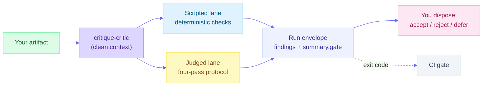

<a id="readme-top"></a>

# [Critique Skills](https://github.com/product-on-purpose/critique-skills)

**A measured library of rubric-cited critique skills that emit machine-parseable findings.**

Every skill operationalizes a published external standard, cites a permanent criterion ID on every finding, and publishes its own measured performance against a seeded-defect corpus. No taste, no vibes, no unfalsifiable commentary.

<p>
  
  <a href="LICENSE"></a>
  <a href="https://github.com/product-on-purpose/critique-skills/releases/latest"></a>
  <a href="https://product-on-purpose.github.io/critique-skills/contributing/"></a>
  <a href="#-the-shelf"></a>
  <a href="https://product-on-purpose.github.io/critique-skills/reference/criteria/"></a>
  <a href="#-the-scoreboard"></a>
  <a href="https://agentskills.io/specification"></a>
</p>

---

### Start here

| You want to | Start at | Then |
|---|---|---|
| **Use it on something** | [Install](#-install), then [the shelf](#-the-shelf): six skills, what each reviews, one prompt each | [`QUICKSTART.md`](QUICKSTART.md) for one run start to finish, [`examples/`](examples/) for a worked walkthrough per skill |
| **Decide whether to believe it** | [The scoreboard](#-the-scoreboard): recall and precision per skill, both pinned model tiers | [The receipts explorer](https://product-on-purpose.github.io/critique-skills/receipts/) for all 54 rows and 541 run envelopes, [`bench/results/README.md`](bench/results/README.md) for the narrative, unflattering numbers first |
| **Build on it or contribute** | [How a critique runs](#-how-a-critique-runs) and [where this stops](#-where-this-stops) | [The methodology](https://product-on-purpose.github.io/critique-skills/explanation/methodology/), the [Critique Contract](docs/reference/critique-contract.md), and [`CONTRIBUTING.md`](CONTRIBUTING.md) |

> [!NOTE]
> **v0.1.6.** The finding contract, the severity scale, and the criterion IDs are stable commitments. The measured numbers are honest but young: one benchmark cycle on two pinned model tiers, with the consistency floor calibrated to **0.309**, well below the 0.7 proposed before any data existed.

---

## 🔍 What this is

Ask a general-purpose model to critique your work and you get fluent, confident, forgettable commentary. It changes between runs. It cites nothing. It cannot tell you whether it found everything or merely something. It has no way to be wrong.

`critique-skills` attacks that one job. The claim is not that these skills critique better than a good model does. It is that they critique **accountably**, which is a different and more durable property. As models improve, generic critique improves with them. It does not acquire citations, repeatability, or ground truth. Those are properties of the system built around the model.

| It is | It is not |
|---|---|
| **Rubric-cited** - every finding carries a permanent criterion ID tracing to a published standard | A "act as a harsh critic" prompt with better wording |
| **Machine-parseable** - findings are structured records with evidence, location, severity, and fix | Prose you re-read and summarize by hand |
| **Measured** - seeded-defect recall, precision, and run-to-run consistency, published with model IDs pinned | A quality claim you are asked to take on faith |
| **Two-lane and honest about it** - deterministic scripts where computation suffices, model judgment only where judgment is required | A single opaque pass that calls everything "AI-powered" |
| **Human-in-the-loop by contract** - skills report, a person disposes, nothing auto-edits | An agent that rewrites your document on its own authority |

<p align="right">(<a href="#readme-top">back to top</a>)</p>

---

## ⚡ Install

The `product-on-purpose` marketplace pins `critique-skills` to the `v0.1.6` release tag, so `/plugin install` gives you exactly that commit rather than whatever `main` happens to hold.

```bash
# Claude Code (recommended)
/plugin marketplace add product-on-purpose/agent-plugins
/plugin install critique-skills@product-on-purpose

# Cross-agent: Cursor, Copilot, Cline, and others via the open skills CLI
npx skills add product-on-purpose/critique-skills

# Or just clone it
git clone https://github.com/product-on-purpose/critique-skills.git
```

There is no separate CLI. Describe what you want in plain language and the matching skill triggers on its own description; every card below carries a prompt you can paste. You get back findings, each with a criterion ID, a severity on a shared 0-4 scale, a navigable location, quoted or measured evidence, and an actionable fix. You dispose them; nothing edits your artifact.

> 📖 One run start to finish: [`QUICKSTART.md`](QUICKSTART.md) · [Full getting-started guide](https://product-on-purpose.github.io/critique-skills/getting-started/)

<p align="right">(<a href="#readme-top">back to top</a>)</p>

---

## 🗂️ The shelf

Every figure below is location-level, both pinned model tiers, k=5, against a seeded-defect corpus. `beats baseline` means the skill located more seeded defects than a rubric-free "critique this" prompt at equal-or-better precision, same artifacts, same model.

<!-- skill-shelf:start -->
<!-- Hand-authored cards: name, rubric, version, one-line scope, a prompt to try, and the boundary against the sibling skill. NO MEASURED FIGURES LIVE HERE. They are in the generated scoreboard above and on each skill's own page, and a third hand-typed copy is exactly the drift this README is being rebuilt to remove. The real generated skill-catalog pair is kept below, collapsed. -->

### `critique-accessibility` · WCAG 2.2 AA · v0.1.1

Reviews HTML pages and fragments (markdown where mappable) for contrast, alt text, heading hierarchy, link text, and keyboard and screen-reader access.

**Try:** `review this page for accessibility problems`
**Not this skill:** general interface flow, controls, and states, which is [`critique-usability`](#critique-usability--nielsens-10-usability-heuristics--v010).
[SKILL.md](skills/critique-accessibility/SKILL.md) · [full page](https://product-on-purpose.github.io/critique-skills/skills/critique-accessibility/)

---

### `critique-argument` · The Toulmin model · v0.1.0

Reviews argumentative prose (essays, proposals, position papers, recommendation memos, strategy docs, op-eds) for whether claim, grounds, warrant, backing, qualifier, and rebuttal are present, explicit, and actually hold together.

**Try:** `check whether this proposal's argument actually holds together`
**Not this skill:** prose readability or sentence mechanics, which is [`critique-clarity`](#critique-clarity--federal-plain-language--williams-style--v010).
[SKILL.md](skills/critique-argument/SKILL.md) · [full page](https://product-on-purpose.github.io/critique-skills/skills/critique-argument/)

---

### `critique-clarity` · Federal Plain Language + Williams' *Style* · v0.1.0

Reviews markdown or plain-text prose for readability, passive voice, sentence length, and nominalization density.

**Try:** `give me a clarity pass on this memo before it goes out`
**Not this skill:** whether an argument's claim is supported, which is [`critique-argument`](#critique-argument--the-toulmin-model--v010).
[SKILL.md](skills/critique-clarity/SKILL.md) · [full page](https://product-on-purpose.github.io/critique-skills/skills/critique-clarity/)

---

### `critique-docs` · Diataxis · v0.1.0

Reviews technical documentation pages and page trees in markdown for tutorial, how-to, reference, and explanation mode fit, plus heading structure, orphaned pages, cross-mode linking, and navigation-list length.

**Try:** `does this documentation page match the mode it claims to be`
**Not this skill:** prose quality inside a page, which is [`critique-clarity`](#critique-clarity--federal-plain-language--williams-style--v010).
[SKILL.md](skills/critique-docs/SKILL.md) · [full page](https://product-on-purpose.github.io/critique-skills/skills/critique-docs/)

---

### `critique-microcopy` · NN/g error-message guidelines · v0.1.0

Reviews error messages, empty states, and other short microcopy strings for plain language, specificity, constructive next steps, neutral tone, and recovery grace.

**Try:** `review these error messages`
**Not this skill:** the surrounding screen's flow, controls, or confirmation behavior, which is [`critique-usability`](#critique-usability--nielsens-10-usability-heuristics--v010).
[SKILL.md](skills/critique-microcopy/SKILL.md) · [full page](https://product-on-purpose.github.io/critique-skills/skills/critique-microcopy/)

---

### `critique-usability` · Nielsen's 10 usability heuristics · v0.1.0

Reviews HTML or markdown UI specs, wireframe write-ups, and page mockups for system status, user control and exits, consistency, error prevention, recognition over recall, and minimalist design. Static specs and mockups, **not** live running applications.

**Try:** `run a heuristic evaluation on this wireframe spec`
**Not this skill:** error and empty-state wording, which is [`critique-microcopy`](#critique-microcopy--nng-error-message-guidelines--v010); accessibility conformance, which is [`critique-accessibility`](#critique-accessibility--wcag-22-aa--v011).
[SKILL.md](skills/critique-usability/SKILL.md) · [full page](https://product-on-purpose.github.io/critique-skills/skills/critique-usability/)
<!-- skill-shelf:end -->

<details>
<summary><strong>The generated catalog table</strong> - the same six skills as machine-written rows from <code>library.json</code> and each <code>SKILL.md</code></summary>

<!-- skill-catalog:start -->
<!-- Generated by `node scripts/gen-readme-catalog.mjs`. Do not edit by hand: edit `library.json` and the relevant skill's `SKILL.md` frontmatter, then regenerate. -->

| Skill | Reviews | Rubric | Version |
|---|---|---|---|
| [`critique-accessibility`](skills/critique-accessibility/SKILL.md) | Reviews HTML pages and fragments (markdown where mappable) against WCAG 2.2 AA: contrast, alt text, heading hierarchy for screen readers, link text, and keyboard and screen-reader access. Judges conformance against WCAG, not an interface's general usability, flow, or controls (critique-usability covers that). | WCAG | 0.1.1 |
| [`critique-argument`](skills/critique-argument/SKILL.md) | Reviews argumentative prose - essays, proposals, position papers, recommendation memos, strategy docs, and op-eds - against the Toulmin model of argument: whether the claim, grounds, warrant, backing, qualifier, and rebuttal are present, explicit, and actually hold together. Judges the argument's structure, not prose readability or sentence mechanics (critique-clarity covers that). | TOULMIN | 0.1.0 |
| [`critique-clarity`](skills/critique-clarity/SKILL.md) | Reviews markdown or plain-text prose for clarity against the Federal Plain Language Guidelines and Williams' Style: readability, passive voice, sentence length, and nominalization density. Judges sentence- and passage-level readability, not whether an argument's claim is supported or its structure holds together (critique-argument covers that). | PLAIN, WILLIAMS | 0.1.0 |
| [`critique-docs`](skills/critique-docs/SKILL.md) | Reviews technical documentation pages and page trees written in markdown against the Diataxis framework: tutorial, how-to, reference, and explanation mode fit, plus heading structure, orphaned pages, cross-mode linking, and navigation-list length. | DIATAXIS | 0.1.0 |
| [`critique-microcopy`](skills/critique-microcopy/SKILL.md) | Reviews error messages, empty states, and other short microcopy strings, including screens annotated with placement, container, timing, and behavior context, against NN/g's error-message guidelines: plain language, specificity, constructive next steps, neutral tone, and recovery grace. Judges the message text itself, not the surrounding screen's flow, controls, or confirmation behavior (critique-usability covers that). | NNG-EM | 0.1.0 |
| [`critique-usability`](skills/critique-usability/SKILL.md) | Reviews HTML or markdown UI specs, wireframe write-ups, and page mockups against Nielsen's 10 usability heuristics: system status, user control and exits, consistency, error prevention and recovery, recognition over recall, and minimalist design. Judges the interface's flow, controls, and states, not the wording of error or empty-state message text (critique-microcopy covers that), and not conformance against accessibility standards such as contrast or screen-reader access (critique-accessibility covers that). | NNG-HEURISTICS, NNG-SEVERITY | 0.1.0 |
<!-- skill-catalog:end -->

</details>

<p align="right">(<a href="#readme-top">back to top</a>)</p>

---

## 📊 The scoreboard

Receipts come before the claim, because that is the order that earns trust.

<!-- bench-scoreboard:start -->
<!-- Generated by `python -m bench.report scoreboard`. Do not edit by hand: edit `bench/results/results.json` and regenerate. -->

| Skill | Recall, haiku | Recall, sonnet | Precision, haiku | Precision, sonnet | Versus rubric-free baseline |
|---|---:|---:|---:|---:|---|
| `critique-accessibility` 0.1.1 | 0.988 | 0.965 | 0.875 | 0.672 | beats on both tiers |
| `critique-argument` 0.1.0 | 0.825 | 0.775 | 0.579 | 0.470 | beats on both tiers |
| `critique-clarity` 0.1.0 | 0.780 | 0.890 | 0.419 | 0.434 | beats on both tiers |
| `critique-docs` 0.1.0 | 0.933 | 1.000 | 0.875 | 1.000 | ties on both tiers |
| `critique-microcopy` 0.1.0 | 0.920 | 0.960 | 0.831 | 0.911 | beats on both tiers |
| `critique-usability` 0.1.0 | 0.800 | 0.857 | 0.231 | 0.169 | beats on haiku, no pass on sonnet |

_Location-level, shipped versions only, run set `p3-2026-07-31-plus-cal1-2026-08-01`. Every figure is computed from `bench/results/results.json`._
<!-- bench-scoreboard:end -->

Recall is the flattering half. The floor is `critique-clarity` on Haiku at **0.309** run-to-run consistency, the lowest figure any core skill measured, with its judged lane alone at **0.150**. Among shipped skills precision falls to **0.169**, on `critique-usability` at Sonnet. Counting the retired `critique-accessibility` 0.1.0 it falls to **0.155**, which is the version [the failure below](#the-most-instructive-number-is-a-failure) is about. Both cuts are named because they are different questions: what you can install today, and what this library has ever measured.

All 54 rows across three cuts, every per-run figure, and all 541 run envelopes: the [receipts explorer](https://product-on-purpose.github.io/critique-skills/receipts/), and [`bench/results/README.md`](bench/results/README.md) in the repo, unflattering numbers first. Nothing lives only on the site.

### The most instructive number is a failure

`critique-accessibility` 0.1.0 shipped, and then **lost to the unrubricked baseline** on location-level recall on both tiers: 0.176 against 0.376 on Haiku, 0.306 against 0.776 on Sonnet.

The root cause was not detection. The scripted lane was finding the defects. One helper was printing a line number where the location grammar required a navigable anchor, so half to three quarters of the skill's claims could not be resolved to anything, while the generic prompt "won" by habitually quoting element IDs it saw in the markup. Version 0.1.1 fixed exactly that and nothing else: location-level recall reads **0.988** on Haiku and **0.965** on Sonnet, beating baseline on both tiers on both metrics.

Both versions stay published side by side. The failure was not deleted when the fix arrived, because the failure is the evidence: measurement caught what review would have shipped.

<p align="right">(<a href="#readme-top">back to top</a>)</p>

---

## ⚙️ How a critique runs



**Clean context.** Where a subagent tool is available, every skill delegates to [`critique-critic`](agents/critique-critic.md) so critique runs in a context that never saw the artifact being authored, and strips authorial steering out of its instructions rather than inheriting the author's blind spots.

**The four-pass protocol.** Inventory without judging, sweep the rubric in fixed ID order, assign severities as a separate pass, then rank and bound. Fixed ordering suppresses fixation drift; separating severity from discovery stops severity inflation.

**Two lanes.** Of 96 criteria, **42 run as deterministic scripts** and **54 require judgment**. Scripted findings are bit-for-bit reproducible; judged findings are not, and the library claims only that they are measured.

**Bounded output.** All severity 3 and 4 findings plus at most five below that, with the suppressed count reported. Verbosity is variance, and unbounded runs cannot be compared.

**A gate you can act on.** `--gate` turns any skill into a document linter: exit 0 clean, exit 1 on any severity 4, exit 2 above a configurable severity-3 threshold ([`docs/how-to/gate-in-ci.md`](docs/how-to/gate-in-ci.md)). Nothing auto-applies: skills report, a human disposes, and the disposition log is both the safety property and the telemetry.

> Full detail, with the four-pass protocol and the contract field by field: [the methodology](https://product-on-purpose.github.io/critique-skills/explanation/methodology/).

<p align="right">(<a href="#readme-top">back to top</a>)</p>

---

## 🧭 Where this stops

**One test decides it: does the framework evaluate a concrete, already-existing artifact against a published external standard? Yes, it ships here. No, it belongs in [`thinking-framework-skills`](https://github.com/product-on-purpose/thinking-framework-skills).**

That is the Two-Part Gate, and it is the library's constitution. Part 1 is artifact dependency: can a finding name a location? Part 2 is external rubric: does every criterion cite a URL or an ISBN? A candidate that clears both ships as a skill; one that clears Part 1 but has no citable standard ships only if the user supplies their own rubric, under BYOR mode.

The rejections matter more than the acceptances, because a gate that admits everything is not a gate. SWOT evaluates a situation rather than an artifact. A pre-mortem assesses something that does not exist yet. Six Thinking Hats is a process protocol, not a standard with criteria. "Is this strategy sound?" has no published rubric that survives citation. All four are thinking, not critique.

This library is also **not code review** (well served elsewhere, out of scope by choice) and **not auto-fix** (skills report, they never edit).

> The full gate with both decision diagrams and the complete rejection table: [the methodology](https://product-on-purpose.github.io/critique-skills/explanation/methodology/).

<p align="right">(<a href="#readme-top">back to top</a>)</p>

---

## 👪 The family

`critique-skills` is the third library in the Product on Purpose family, built to the same [agent-skills-toolkit](https://github.com/product-on-purpose/agent-skills-toolkit) Standard:

- [`thinking-framework-skills`](https://github.com/product-on-purpose/thinking-framework-skills) - the sibling on the other side of the gate: evidence-graded thinking methods applied *before* an artifact exists.
- [`pm-skills`](https://github.com/product-on-purpose/pm-skills) - product management skills and sub-agents across the product lifecycle.
- [`writing-style-catalog`](https://github.com/product-on-purpose/writing-style-catalog) - composable writing instructions along four orthogonal axes.
- [`agent-skills-toolkit`](https://github.com/product-on-purpose/agent-skills-toolkit) - the Standard and validators every family plugin conforms to.

None depend on each other technically. They compose along one value chain: **think** with one, **make** with another, **judge** the result with this one.

<p align="right">(<a href="#readme-top">back to top</a>)</p>

---

## 📖 Documentation

**[The documentation site](https://product-on-purpose.github.io/critique-skills/)** carries the full set: the [six skill pages](https://product-on-purpose.github.io/critique-skills/skills/), the [criteria explorer](https://product-on-purpose.github.io/critique-skills/reference/criteria/) for all 96 IDs, the [receipts explorer](https://product-on-purpose.github.io/critique-skills/receipts/), [the methodology](https://product-on-purpose.github.io/critique-skills/explanation/methodology/), and [the bar a change has to clear](https://product-on-purpose.github.io/critique-skills/contributing/).

Everything on the site is a rendering of something in this repo. Nothing lives only there.

| In the repo | What |
|---|---|
| [`QUICKSTART.md`](QUICKSTART.md) | Install, run one critique, read the envelope, record a disposition |
| [`examples/`](examples/) | Worked walkthroughs for all six skills, plus cross-cutting recipes |
| [`docs/`](docs/) | Diataxis source: tutorials, how-to, reference, explanation |
| [`bench/results/README.md`](bench/results/README.md) | Results narrative, unflattering numbers first, and the full 54-row grid |
| [`ROADMAP.md`](ROADMAP.md) | Sequence-gated plan to v1.0, including what is deliberately not being done |
| [`CONTRIBUTING.md`](CONTRIBUTING.md) | The Two-Part Gate as the bar for a new skill, the review order, the paraphrase policy |
| [`SECURITY.md`](SECURITY.md) | What ships, what executes at checkout, how to report a vulnerability |
| [`AGENTS.md`](AGENTS.md) | Agent-facing entry point and the full command reference |

<p align="right">(<a href="#readme-top">back to top</a>)</p>

---

## 📈 Project status

`v0.1.6`. The contract, the severity scale, and the criterion IDs are stable commitments; the measured numbers are one honest cycle, not a settled science.

|  |  |
|---|---|
| **Current version** | v0.1.6 |
| **Skills** | 6, across design, communication, and documentation |
| **Criteria** | 96 (42 scripted, 54 judged), each with a permanent ID |
| **Subagents** | 1 (`critique-critic`, clean-context) |
| **Conformance** | convergent (Silver), 0 errors / 0 warnings; reproduce with `node scripts/check.mjs` |
| **Measurement** | 999 committed run envelopes, k=5, two pinned model tiers, 23-artifact seeded corpus |
| **Tests** | 911 Python, 126 Node; reproduce with `python -m pytest -q` and `npm test` |
| **License** | [Apache-2.0](LICENSE) (code) / CC-BY-4.0 (corpus) |

History: [`CHANGELOG.md`](CHANGELOG.md) for technical detail, [`RELEASE-NOTES.md`](RELEASE-NOTES.md) for curated highlights, [`ROADMAP.md`](ROADMAP.md) for what is next.

<p align="right">(<a href="#readme-top">back to top</a>)</p>

---

## 🤝 Contributing

Contributions are welcome, and the bar is deliberately high, because the bar is the product. A new skill must clear the Two-Part Gate above, and then seven more things that are easier to skip: permanent namespaced criterion IDs, a declared lane split with the scripted lane actually deterministic, contract-conforming findings with real locations and quoted evidence, domain severity anchors, correct provenance with no reproduced source text, and evidence.

That last one is the least negotiable. **A skill with no measured performance is a draft, not a contribution**, because a well-written unmeasured skill weakens the library's claim more than a missing skill does.

Run the gate locally before opening a PR (`node scripts/check.mjs`); CI runs the same command. Full detail: [`CONTRIBUTING.md`](CONTRIBUTING.md).

<p align="right">(<a href="#readme-top">back to top</a>)</p>

---

## 📄 License

Code and skills under the **[Apache License 2.0](LICENSE)**. The **benchmark corpus** (`bench/corpus/`) under **[CC BY 4.0](https://creativecommons.org/licenses/by/4.0/)**, so others can benchmark against it with credit and a note of what changed.

**On rubrics and copyright.** This library never reproduces copyrighted rubric text. It encodes original-wording operationalizations with citations and points to the source. Open standards (WCAG, Diataxis, the Federal Plain Language Guidelines) are referenced directly; copyrighted material (NN/g articles, Williams, Toulmin) is paraphrased and cited. Each skill declares which applies in its `rubric_sources` frontmatter.

<p align="right">(<a href="#readme-top">back to top</a>)</p>

---

## 👋 About the maintainer

<a href="https://github.com/jprisant"></a>

Built and maintained by **Jonathan Prisant** ([@jprisant](https://github.com/jprisant)), a product leader who thinks in systems and gets unreasonably excited about understanding and solving problems. `critique-skills` is the judging end of the family value chain: [`thinking-framework-skills`](https://github.com/product-on-purpose/thinking-framework-skills) helps decide what to work on, [`pm-skills`](https://github.com/product-on-purpose/pm-skills) helps execute it, and this library tells you, with receipts, whether what came out is any good.

*If this library has caught something before your readers did, consider starring the repo and sharing it with your team.*

<p align="center">
  <strong>Built with purpose by <a href="https://github.com/product-on-purpose">Product on Purpose</a></strong><br>
  <sub>Critique with citations, evidence, and receipts</sub>
</p>

<div align="right"><a href="#readme-top">Back to top ↑</a></div>
