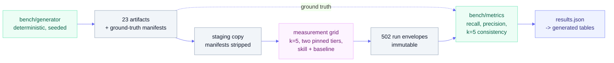

# Architecture in detail

The companion to [Architecture overview](architecture.md). That page says what the parts are; this
one says why they are shaped that way, and what happens if you change them.

## 1. The two-lane split, and what decides the line

Every skill declares its criteria in two sets in `SKILL.md` frontmatter: `checks.scripted` and
`checks.judged`. Across the six skills that is 42 scripted and 54 judged, 96 total.

| Skill | Scripted | Judged | Rubric sources |
|---|---:|---:|---|
| `critique-accessibility` | 13 | 9 | WCAG 2.2 AA |
| `critique-argument` | 2 | 6 | Toulmin |
| `critique-clarity` | 15 | 8 | Federal Plain Language Guidelines, Williams' *Style* |
| `critique-docs` | 3 | 6 | Diataxis |
| `critique-microcopy` | 6 | 8 | NN/g error messages |
| `critique-usability` | 3 | 17 | Nielsen's heuristics, NN/g severity |

**The line is drawn by whether computation suffices, never by convenience.** A criterion is
scripted when a deterministic program can decide it from the artifact alone: contrast ratios,
heading depth, sentence length, the presence of an `alt` attribute. It is judged when deciding it
requires reading for meaning: whether a warrant is missing, whether an error message actually tells
you what to do next, whether a page is really a tutorial.

Two consequences fall out of this, and both matter more than the split itself:

- **The scripted lane is byte-reproducible with no model at all.** That is why the benchmark's
  scripted half can be re-derived from committed code, and it is the strongest evidence in the
  repository. It is also why `critique-clarity` (15 scripted criteria) behaves very differently
  under measurement from `critique-usability` (3 scripted, 17 judged).
- **The split is a per-skill declaration, not a global rule, and it can move.** `DIATAXIS-ORPHAN`
  moved from scripted to judged during the v0.1.0 build. Anything that assumes lane membership is
  fixed is assuming something the design does not promise.

## 2. The contract is the coupling point, and it is frozen on purpose

`contract/critique-contract.schema.json` defines three things: the **finding**, the **run envelope**
that carries findings plus a run record, and the **disposition log** that records what a person did
about them.

Everything else in the repository is downstream of that file. The skills emit it. The bench scores
it. `--gate` computes CI exit codes from it. A consumer repository can gate its own pipeline on it
without importing anything else here.

**Frozen means a required-field change is a breaking change, not an edit.** That is what lets an
external consumer depend on the shape. The freeze is why:

- the validator enforces rules the schema cannot express (see `contract/README.md`, "Rules the
  validator enforces beyond the schema"), rather than the schema growing to absorb them;
- output bounding (at most five emitted findings below severity 3) is a validator rule with a
  `--strict` promotion path, not a schema constraint;
- severity is a shared 0-4 scale with per-domain anchors, so a severity 3 means the same class of
  thing in an accessibility run and a microcopy run.

`jsonschema` is the one third-party runtime dependency, imported lazily so a machine without it gets
an actionable message rather than an import traceback ([ADR 0009](../internal/decisions/0009-python-node-toolchain-split.md)
sets the dependency-light rule; the lazy import is documented in `contract/validate.py` itself).

## 3. Clean context is a structural guarantee, not an instruction

`agents/critique-critic.md` exists so a critique can be run by something that has not seen the
drafts, the authoring history, or the requester's opinion of the artifact. A skill delegates to it
where a subagent tool is available.

This is worth stating plainly because it is easy to mistake for politeness. A model that has just
helped you write a document is a poor judge of it: it has the author's frame. Clean context is the
only mechanism in the system that removes that frame, and it is also what made the benchmark's
measurement runs independent of each other (one fresh context per run, k=5).

The subagent is also the reason the same protocol can run two ways, and that has a cost: output
shape can depend on whether a subagent tool is available in the session. The critic's output
contract is envelope-only, so any instruction telling a skill to add prose alongside the envelope
has nowhere legal to put it. Anything a run needs to say must be expressible as a finding.

## 4. Measurement, and why it is separate from everything above

`bench/` is deliberately not in the runtime path. It exists to answer one question: **of the defects
that are actually there, how many does a skill recover, and how repeatably?**

In text: a deterministic seeded generator produces 23 corpus artifacts with ground-truth manifests
recording every planted defect. A staging copy with the manifests stripped is what runners see. The
measurement grid runs each artifact five times per model tier, in both a skill condition and a
frozen generic-prompt baseline condition, producing 502 immutable run envelopes. Scoring joins those
envelopes against the ground truth the runners never saw, and the results file generates the
published tables.

Four design choices carry most of the weight:

- **Ground-truth isolation.** Runners read from a staging copy with manifests removed. A runner that
  can see the answer key measures nothing.
- **A frozen baseline condition.** Every skill is compared against a generic "critique this" prompt
  on the same artifacts and the same pinned model. Without it, a good-looking recall number says
  nothing about whether the rubric contributed anything.
- **k=5 per cell.** Run-to-run agreement is a published metric, not an assumption. The floor
  calibrated to 0.309, well below the 0.7 that was proposed before any data existed.
- **Envelopes are immutable evidence.** `bench/results/runs*/` is never edited or regenerated. The
  numbers are recomputed from the envelopes, not maintained alongside them.

The honest limit, stated here because it is architectural: **the published numbers were produced by
Claude Code workflow subagents, not by the committed `bench/run_bench.py` harness**, which
reimplements the same protocol as direct API calls. The two are not byte-equivalent. See
[`bench/results/README.md`](../../bench/results/README.md) under Provenance, and
[P3-cal1-provenance.md](../internal/execution/P3-cal1-provenance.md).

## 5. The gate, and why it points at another repository

`scripts/check.mjs` does not implement conformance checks. It wraps `agent-skills-toolkit`'s
checker, pinned by commit SHA in `TOOLKIT_REF` ([ADR 0011](../internal/decisions/0011-gate-wiring-toolkit-wrapper.md)).

Wrapping rather than vendoring means this repository never carries a stale copy of the family
Standard, and the pin means an upstream change cannot silently move this repository's grade. Both
properties are load-bearing; the cost is that adopting an upstream fix is an explicit commit here.

One thing to keep in view when reading a green gate: the toolkit tags every check with a
`provenance` of `vendor-cited`, `objective`, or `house`, and the Silver and Gold tiers are entirely
`house`. A clean gate at Convergent is a statement about family conventions. It is not a statement
that a fresh `/plugin install` works, which is a different question with a different answer, and one
this repository learned the hard way.

## 6. Extension points

**Adding a skill.** The gate is the Two-Part Gate in [Methodology](methodology.md) section 2: the
framework must evaluate a concrete existing artifact, and it must cite a published external
standard. Then the skill directory shape is fixed (`SKILL.md`, `references/`, `scripts/checks.py`,
`scripts/tests/`, `evals/`, `examples/`), the criteria get permanent IDs under a declared source
prefix, and the skill does not ship until it is measured against a corpus with planted defects.

**BYOR (bring your own rubric).** The `rubric_source: byor` marker is already defined in the
methodology. It is how a user hands the library a rubric it did not ship with, using the same
contract, the same severity scale, and the same evidence requirements. This is the extension point
that keeps "cite a published standard" from meaning "cite one of ours".

**Consuming the contract.** A repository that wants to gate on critique findings needs only the
schema and `--gate` exit codes. See [Gate in CI](../how-to/gate-in-ci.md).

## 7. What would change the architecture

Stated so a later reader can tell a design change from a bug fix:

- **A required contract field** would be a major version, not a minor one.
- **Making the judged lane deterministic** is not possible without abandoning the criteria that
  require reading for meaning, which is most of `critique-usability`.
- **Auto-fix** would require a patch format in the contract and would remove the human disposition
  step. It is out of scope by choice, recorded in the public roadmap under "Deliberately not doing".
- **Driving the reproduction harness through Claude Code rather than the API** would make a live
  benchmark run reproduce the published mechanism instead of validating a second implementation of
  it. That is a live design question, not a settled one.
