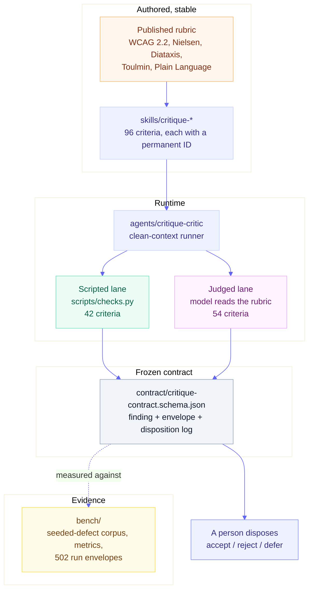

# Architecture overview

How the pieces fit, and what each one is responsible for. For the reasoning behind the shape,
and for the extension points, read the companion page:
[Architecture in detail](architecture-detail.md).

## The one-sentence version

A skill turns a published external rubric into a fixed list of criteria; a run sweeps those
criteria in two lanes, one deterministic and one judged; every defect it finds is emitted as a
structured record against a frozen schema; and a benchmark with known planted defects measures how
much of the truth that process actually recovers.

## The five parts

In text: a published rubric is operationalized into a skill carrying 96 permanent criterion IDs.
The `critique-critic` subagent runs that skill in clean context, splitting the work into a scripted
lane (42 criteria, deterministic Python) and a judged lane (54 criteria, model judgment against the
rubric text). Both lanes emit into one frozen JSON Schema contract. The resulting record goes to a
person to dispose, and is separately measured against a seeded-defect benchmark.

| Part | Lives in | Responsible for | Stability |
|---|---|---|---|
| **Skills** | `skills/critique-*/` | Turning one published rubric into an ordered list of criteria, each with a permanent ID and an operational test | Criterion IDs are permanent; the set grows |
| **Contract** | `contract/` | The shape of a finding, a run envelope, and a disposition log, plus the validator and `--gate` exit codes | **Frozen.** A required-field change is a breaking change, not an edit |
| **Critic subagent** | `agents/critique-critic.md` | Running a skill's protocol in clean context, so no authoring history or prior opinion leaks into the judgment | Stable |
| **Bench** | `bench/` | Generating artifacts with known planted defects, running the measurement grid, and scoring recall, precision, and consistency | Envelopes are immutable evidence |
| **Gate** | `scripts/check.mjs` | Grading this repo against the family Standard, by wrapping the pinned `agent-skills-toolkit` checker | Toolkit pinned by SHA |

## How one critique runs

1. **Selection.** You describe what you want in plain language. The matching skill triggers on its
   own `description`; nothing is invoked by name. Six sibling skills make this a real routing
   problem, which is why the descriptions carry explicit boundary clauses and why
   [`evals/joint-routing.eval.json`](../../evals/joint-routing.eval.json) exists.
2. **Clean-context handoff.** Where a subagent is available, the skill delegates to
   `critique-critic`, which has seen no drafts, no authoring history, and no opinion about the
   artifact.
3. **Inventory.** The runner reads the artifact's structure and records nothing yet. This pass
   exists so the sweep does not anchor on whatever was noticed first.
4. **Criterion sweep, in fixed ID order.** Every criterion is evaluated against the whole artifact
   before moving to the next. The scripted lane runs `scripts/checks.py`; the judged lane is the
   model working criterion by criterion against the rubric text in `references/`.
5. **Severity, as its own pass.** Only after the sweep completes is severity assigned, on a shared
   0-4 scale, weighing impact first, then frequency, then persistence. Assigning severity while
   still discovering problems inflates it.
6. **Rank and bound.** Findings are ordered by severity and the output bound is applied once over
   the combined pool: at most five emitted findings below severity 3.
7. **Emit and dispose.** The result is a contract-valid run envelope. **Nothing edits your
   artifact.** A person accepts, rejects, or defers each finding, and that disposition is itself a
   contract-valid record.

## What the architecture refuses to do

Three constraints are structural, not preferences, and each closes off a shape the system could
otherwise have taken:

- **No auto-fix.** Skills report; a person disposes. There is no code path that writes to your
  artifact, which is why the contract has a disposition log and no patch format.
- **No criterion without a citable source.** Every criterion traces to a published standard with a
  URL or an ISBN, or to a rubric the user supplied under BYOR. This is what makes a finding
  arguable rather than a matter of taste.
- **No skill that cannot be measured.** A seeded-defect corpus and a results table are load-bearing.
  A rubric with no way to measure recovery against ground truth does not ship as a skill.

## Where to go next

- [Architecture in detail](architecture-detail.md) - why the two-lane split, how the contract
  couples the parts, how measurement works, and where the extension points are.
- [Methodology](methodology.md) - the constitution: the Two-Part Gate, the determinism model, and
  the output-bounding rule.
- [The critique contract](../reference/critique-contract.md) - the normative field reference.
- [`bench/results/README.md`](../../bench/results/README.md) - the measured numbers, unflattering
  ones first.
