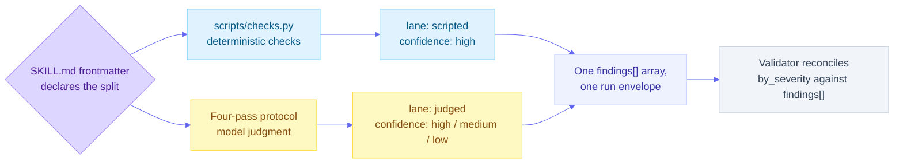

# Critique contract

This page is commentary on [`contract/critique-contract.schema.json`](../../contract/critique-contract.schema.json), the machine-parseable interface every critique-skills component produces or consumes. It links to and quotes the schema; it does not restate it. For the exhaustive required-field tables, the versioning rules, and the validator rules JSON Schema itself cannot express, read [`contract/README.md`](../../contract/README.md); that file is the schema's own specification and stays authoritative over anything said here. The schema itself states that where it and [the methodology, section 5](../explanation/methodology.md#5-the-critique-contract) disagree, the methodology is correct and the schema is a bug.

## Three documents, one file

The schema defines three document shapes and dispatches on one key: a document carrying `dispositions` validates as a disposition log (`#/$defs/dispositionLog`, anchor `#dispositionLog`); every other object validates as a run envelope (`#/$defs/envelope`, anchor `#envelope`). A bare finding is validated by referencing `#/$defs/finding` directly (anchor `#finding`), since a finding never appears at a document root on its own, only inside an envelope's `findings` array.

## Where enforcement stops

A finding can satisfy every rule in the schema and still break the contract. That is not a defect in the schema; it is the shape of the problem. Knowing exactly where the machine stops and the reviewer starts is what keeps a passing validator from being mistaken for a good critique, so the boundary is published here rather than left to be discovered.

Enforcement comes in three layers, and every rule in the contract sits in exactly one of them.

| Layer | What holds it | What it can decide |
|---|---|---|
| Schema | `critique-contract.schema.json`, patterns and types | The shape of a document: required fields, enums, grammars, lengths, house style on typed prose |
| Validator | `contract/validate.py`, the eleven rules in [`contract/README.md`](../../contract/README.md) | Agreement between parts of one document: counts against findings, gate against counts, namespaces against rubrics, IDs against their envelope |
| Review | The skill's instructions, the critic subagent's protocol, the human doing disposition | Whether the content is true, and whether a field means what the methodology says it must mean |

The third layer is not a weaker version of the first two. It is the layer that decides whether the critique is any good.

### Review-only: the field contracts

These are [methodology section 5](../explanation/methodology.md#5-the-critique-contract) field contracts. Each one is stated as a rule the writer must follow and none of them is decidable by a pattern.

- **`location`** must be specific enough that a reader navigates to it unaided. A string like "the hero banner in section 2" satisfies the contract; "throughout the document" satisfies the schema's length and character rules while failing the contract, because a reader given only that string cannot go anywhere. A recurring breach gets one finding per instance or one finding with an `instances` list, never both for the same occurrences.
- **`evidence`** must be a quotation taken from the artifact or a measurement of it, never a characterization of it. "The contrast seems low" is schema-valid prose and contract-breaking evidence; a contrast ratio computed from the artifact's actual colors is not.
- **`violation`** must name the specific part of the criterion that was breached, not merely assert that something is wrong. Restating the finding's own existence in different words is not a violation statement.
- **`fix`** must be actionable and specific enough to execute without further judgment. "Improve clarity" passes every rule the field has and fixes nothing.
- **`lane`** must record where the finding actually came from. A judged finding labelled `scripted` is undetectable in the document and dishonest about the library's determinism claim, which is the one claim the lane split exists to support.
- **`severity`** must be the severity the artifact deserves. The validator makes the histogram agree with `findings[]`; nothing can make either agree with reality. A run that rates a catastrophe a 2, or everything a 4, emits a valid envelope.
- **`stripped_context`** must record every piece of framing that was actually disregarded. An absent field asserts that nothing was stripped, and only the critic knows whether that is true.
- **`rubric_source`** must be `byor` for every finding of a BYOR run. The schema forces it whenever the criterion starts `BYOR-`, but a user rubric may declare its own namespace, and nothing in the envelope records which mode the run was in.

### Machine-checked: what a passing validator does mean

Stated so the boundary reads in both directions. A document that validates has been checked for all of this, and a reviewer need not re-check any of it by hand:

- every required field is present, and no unknown field is, anywhere except the reserved `selector`;
- `criterion` matches the [criterion ID grammar](criterion-ids.md), `severity` is an integer 0 to 4, `lane`, `confidence`, `rubric_source`, `gate`, and `disposition` are inside their enums, and a `scripted` finding is `high` confidence;
- `artifact` is a relative POSIX path, `timestamp` is RFC 3339 UTC naming a real instant, and `artifact_sha256` is 64 lowercase hex characters;
- no em dash and no en dash appears in any string in the document, keys included, `selector` included;
- finding IDs are unique, `by_severity` reconciles with `findings[]` plus `suppressed_count`, severities 3 and 4 are not suppressed, `gate` equals the recomputed verdict, every criterion namespace appears in `run.rubrics`, and every integer field is an integer literal rather than a float the schema would otherwise admit;
- a disposition log's entries resolve against the referenced envelope, whenever that envelope is available.

Two things are reported but not fatal, and `--strict` promotes both: more than five emitted findings below severity 3, and a run that passes the gate only because of the `severity_3_threshold` it declared for itself.

The full list, with the reasoning for each rule, is in [`contract/README.md`](../../contract/README.md). Why the review-only layer is accepted rather than approximated by a heuristic is [0016 (contract enforcement boundary)](../internal/decisions/0016-contract-enforcement-boundary.md).

## The two lanes, merged into one envelope

Each skill declares its scripted/judged split in `SKILL.md` frontmatter ([methodology section 7](../explanation/methodology.md#7-determinism-model)). The two lanes run through different mechanisms and land in the same `findings[]` array, distinguished only by the `lane` field each finding carries:

In text: frontmatter routes each criterion to one of two lanes. The scripted lane runs `scripts/checks.py` and every finding it produces carries `lane: scripted` and forced `confidence: high`. The judged lane runs the four-pass protocol and its findings carry `lane: judged` with a `confidence` the model actually earned. Both lanes write into the same `findings[]` array of one run envelope, and the validator reconciles `summary.by_severity` against that merged array, never against either lane alone.

## Envelope walkthrough

A run envelope has exactly three top-level keys.

`run` is the reproducibility record: which skill and skill version ran, which contract version the envelope was written against, the artifact's path and SHA-256, the pinned model ID, an RFC 3339 UTC timestamp, and the `rubrics` array of every criterion namespace the run drew on. It optionally carries `stripped_context`, the clean-context ledger of authorial framing, requester opinion, prior critique, or scope steering that arrived with the artifact and was disregarded; see [0014 (stripped context, a typed run field)](../internal/decisions/0014-stripped-context-run-field.md) for why that ledger is typed rather than a free-text notes field.

`findings` is the array of findings this run actually emits, after output bounding. Empty is valid and expected for a clean artifact. A finding the output bound suppressed does not appear here; it is still counted in `summary.by_severity`, so nothing about it disappears silently, only its prose does.

`summary` is the one object the gate reads. `by_severity` is a complete histogram, all five keys `0` through `4`, counting every finding the run produced including the suppressed ones. `suppressed_count` is how many of those the output bound removed from `findings`. `gate` is the computed verdict, `pass` or `fail`, and the validator recomputes it independently, treating a mismatch as a contract violation rather than trusting the emitted value. `severity_3_threshold` is the severity-3 count this particular run was allowed to carry without failing, recorded on the envelope so the exit code stays computable from `summary` alone, without re-deriving it from a CLI flag that may not be available to a later reader.

Location, for non-linear artifacts, has a second, reserved channel: `finding.selector` and `instances[].selector` are the one object in the whole schema that accepts unknown properties, deliberately unvalidated in contract 1.x because no location grammar has been agreed across text, HTML, and visual artifacts yet. See [0012 (location grammar, free text plus reserved selector)](../internal/decisions/0012-location-grammar-freetext-plus-reserved-selector.md). Producers may write it; no v0.1 consumer is permitted to read it. One rule still follows a document in there: the house-style ban on em dashes and en dashes is enforced by the validator over every string in the document rather than by pattern, so the reserved object is not a way around it.

## Gate exit codes

`--gate` mode computes an exit code from `summary` alone. The effective severity-3 threshold is the CLI's `--threshold` argument when given, and `summary.severity_3_threshold` otherwise; the default threshold is 0.

| Exit | Condition |
|---|---|
| 0 | Clean: no severity 4, and severity-3 count at or below the threshold |
| 1 | Any severity 4 |
| 2 | Severity-3 count above the threshold |
| 3 | Input is not a contract-valid document |
| 4 | Usage error: bad arguments, or a file that cannot be read or parsed |

Exit 1 takes precedence over exit 2, so a run with both a severity-4 finding and an over-threshold severity-3 count exits 1. Exits 3 and 4 exist so a malformed envelope, or a CLI invocation gone wrong, can never be mistaken for a passing gate. Without `--gate`, the CLI exits 0 for a valid document and 1 for an invalid one. Two invocations that look like edge cases are usage errors on purpose: a negative `--threshold`, which would fail a run with no severity-3 findings at all, and `--gate` on a disposition log, which is a perfectly valid document that has no gate verdict to report.

**Pass `--threshold` when the envelope is not yours.** Storing the threshold is what keeps the exit code computable from `summary` alone, but the thing that produced the envelope is the skill being judged, and a run may declare a threshold generous enough to pass itself. The counts cannot be faked, since the validator reconciles them against `findings[]`; the pass mark can be. The validator warns when a run passes only because of its own threshold, `--strict` makes that warning fatal, and an explicit `--threshold` removes the question.

This table mirrors [`contract/README.md`](../../contract/README.md), section "Gate exit codes"; if the two ever disagree, that file is the one to trust, since it is the validator's own specification.

## Versioning, briefly

`contract_version` belongs to the schema file alone, independent of the plugin version in `library.json`, starting at 1.0.0. Patch releases are editorial, minor releases add optional fields or relax constraints, and anything that changes a required field or a field's meaning ships as a new schema file at a new path rather than a version bump in place. See [0013 (contract versioning, independent of the plugin)](../internal/decisions/0013-contract-versioning-independent.md) for the full reasoning and the level definitions.

## See also

- [Severity scale](severity-scale.md), the `severity` field's shared scale and domain anchors.
- [Criterion IDs](criterion-ids.md), the `criterion` field's grammar and namespace registry.
